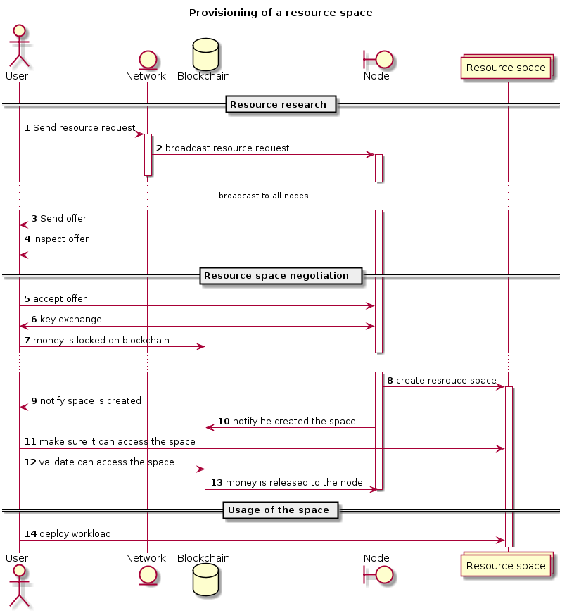

# Proposal for a global IT resource market

## Definitions

- A node is an autonomous piece of hardware that belongs to a farmer.
- A farmer is someone that provide hardware and connect it to the grid
- A user is anyone that want to use capacity from the nodes on the grid

## Proposal

The way for a user to reserve capacity on the grid is to create a "capacity request". This request is a description of a low level resources needed by the user. It is expressed in term of CPU, memory, storage and network. Other kind of filter can also be included in the request, like location, farmer, ...

Once the request is defined, the user "broadcast" it to the grid network.
All the nodes can see the resource requests created by the user and if the node decide it can provide what is requested, it sends an offer to the user.

If a user and a node agree on a request/offer, a sell is initiated. A sell is an agreement between a node and a user. The node engage itself to provide the capacity requested by the user. Then the following flow starts:

- The amount of money needed to pay the capacity is paid by the user and locked
- Some negotiation happens between the node and the user
  - Exchange of keys
- the node creates the "resource space" and user the user key to encrypt what needs to be encrypted
- The node then notify the user his space is ready, and how he can access it
- The user verify it can access the space
- The transaction is now finished, both parties have done their part, the money is unlocked
- The user can start deploying workload in its resource space.

## Remarks

### Pro

- This design is completely plug and play for the farmers. The only things to do it power on the node and attached a wallet address where the send the token generated by sold capacity.
- Very resilient architecture. Node can just come and go in the network.

### Cons

- This proposal assume all the node and users are part of a global network where anyone can broadcast message to anyone. This by itself it a challenge to get right.
- This design kinda linked the node provisioning logic with a blockchain