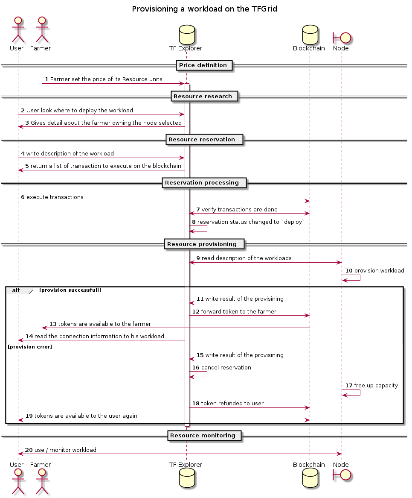

# TFGrid provisioning

This document describe the flows used in the TFGrid to provision capacity.

## Actors

- **User 3bot**: digital avatar of a user. This is the one buying capacity on the grid.
- **Farmer 3bot**: digital avatar of a farmer. It owns some node in the grid and is responsible to set the price of its node capacity.
- **TF Directory**: Public directory listing all the nodes/farmers in the grid
- **TFChain**: money blockchain, money transaction are executed on this chain using ThreefoldToken (TFT).
- **Notary chain**: Chain used to store capacity reservations.
- **Node**: Hardware running 0-OS and responsible to provide capacity to the TFGrid.

## Reservation user story

### A user wants to deploy a container on the grid

- User select the node/farm he wants to use (location, uptime, ...)
- User start prices negotiation with the selected farmer 3bot.
- Once price is agree with both parties, client create 2 transactions
  - Money transaction: to lock money needed for the workload
  - Notary transaction: description of the workload
- User can ping the selected node to notify it some provisioning request is available
- The node read the description of the workload to provision from the notary chain
- Then actually provision the workload
- Once the workload is up and running, the node notify the user 3bot of the completion of the deployment
- The user can now access/monitor  it's workload
