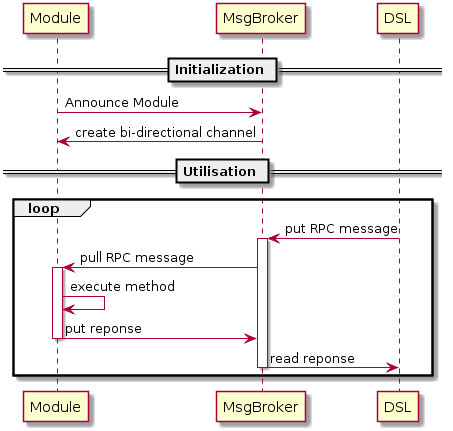

# Requirements
- A component can register one or more `objects`
- Each object can have a global name, where clients can use to call `methods` on the registered objects
- Objects interface need to explicitly set a version. Multiple versions of the same interface can be running at the same time
- A client, need to specify the object name, and interface version. A Proxy object can be used to call the remote methods
- Support mocked proxies to allow local unit tests without the need for the remove object

## Suggested message brokers
- Redis
- Disque
- Rabbitmq


## Overview


## POC
Please check [zbus](https://github.com/threefoldtech/zbus) for a proof of concept

## Example

Server code
```go
//server code should be something like that
type Service struct{}

func (s *Service) MyMethod(a int, b string) (string, error) {
    //do something
    return "hello", nil
}

func main() {
    server = zbus.New() // config ?
    var s Service
    server.Register("my-service", "1.0", s)

    server.Run()
}
```

Client code
```go

func main() {
    client = zbus.Client() // config?

    //client is a low level client we should have some stubs on top of that that hide the call

    c := ServiceStub{client}

    res, err := c.MyMethod(10, "hello")
}
```